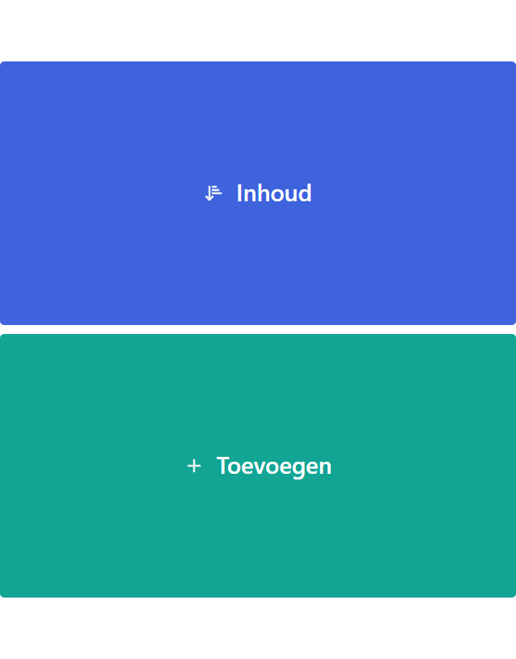
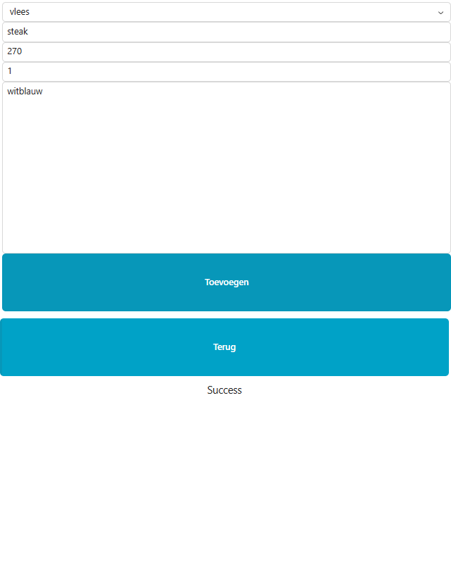
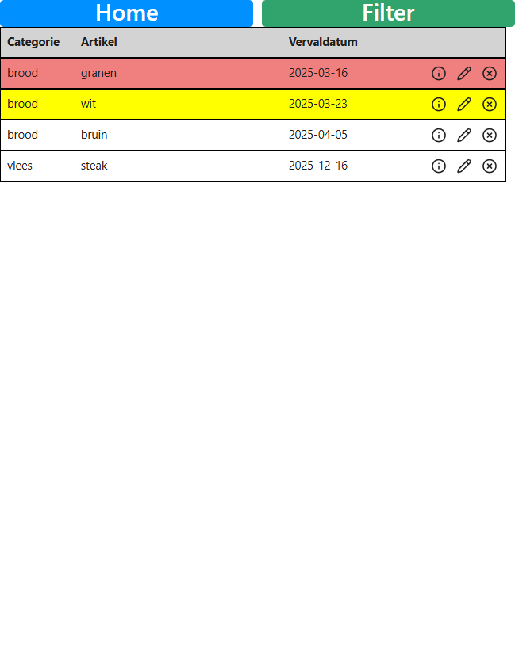
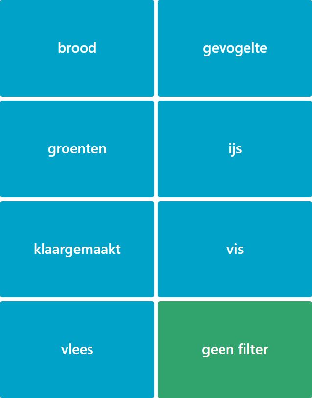

# Freezer
Freezer content tracker using the reflex framework

## screenshots (mobile)
<table>
  <tr>
    <td></td>
    <td></td>
  </tr>
  <tr>
    <td></td>
    <td></td>
  </tr>
</table>

## local development instructions
install the dependencies using poetry
```
poetry install --no-root
```
run the app
```
reflex run
```
or run in debug mode
```
reflex run --loglevel debug
```

## configuration
FRONTEND_PORT=3001 sets the http port

## database
- the database url is set up in `rxconfig.py` 
- the database models are defined in `models.py`
- the database is created by running `reflex db init`
- when changes to the models are made reflex uses alembic to create a migration script: `reflex db makemigrations --message "something changed"`
- after checking the migration script you can execute it using `reflex db migrate`
- populate with default data: `python freezer\models.py`

## docker
- set up following this guide: https://reflex.dev/blog/2024-10-8-self-hosting-reflex-with-docker/
- composing 3 containers 
  - frontend
  - backend
  - redis
- run it: `docker compose up ` 
- after modifying the code, rebuild it using `docker compose up --build` 